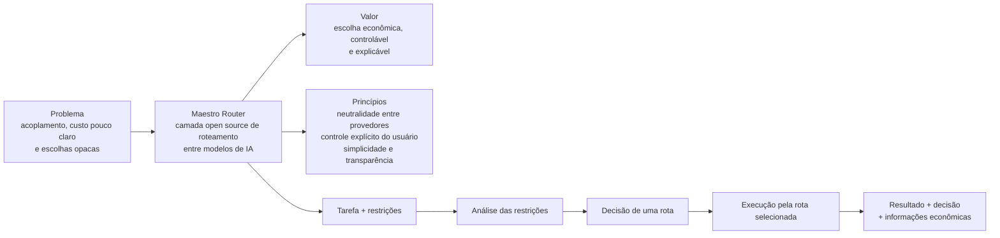

# Mapa do produto

> **Mapa de navegação não normativo.** Esta visão resume o Maestro Router como produto. Em caso de divergência, prevalecem os [documentos normativos](../INDEX.md).

## O que o Maestro é

Uma camada open source que escolhe uma rota contextual entre modelos de IA. O foco atual é o roteamento econômico; o Maestro não cria modelos nem coordena múltiplos modelos no fluxo normal do MVP.

## Problema que resolve

Reduz o acoplamento permanente a um provedor e torna controlável a escolha entre alternativas com diferentes capacidades, custos, qualidades e condições conhecidas.

## Princípios do produto

- neutralidade entre provedores;
- restrições e custos sob controle explícito do usuário;
- decisões justificáveis, sem preferência oculta;
- economia somente entre rotas compatíveis;
- evolução simples, modular e incremental.

## Fluxo de valor

**Receber a tarefa → analisar restrições → decidir uma rota → executar uma opção → devolver resultado, decisão e informações econômicas disponíveis.**

## Onde se aprofundar

- [Manifesto](../00-MANIFESTO.md): identidade e princípios inegociáveis.
- [Visão Geral](../01-VISAO-GERAL.md) e [Proposta de Valor](../02-PROPOSTA-DE-VALOR.md): problema, produto, públicos e limites das promessas.
- [Casos de Uso](../04-CASOS-DE-USO.md): comportamentos observáveis do MVP.
