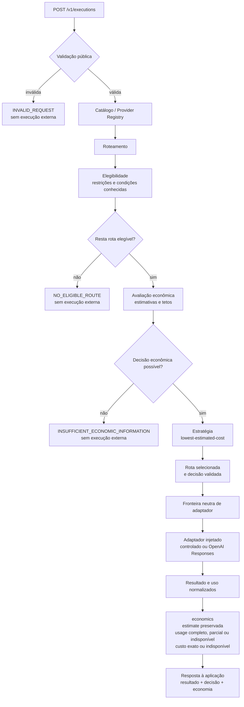

# Mapa do sistema

> **Mapa de navegação técnica não normativo.** Esta visão resume o fluxo do sistema e não substitui a [arquitetura normativa](../03-ARQUITETURA.md) nem os contratos especializados.

## Fluxo principal

A API valida a solicitação, consulta alternativas neutras, aplica elegibilidade antes da economia e usa a estratégia configurada para selecionar exatamente uma rota. Só uma decisão válida permite acionar o adaptador associado. Existe um primeiro adaptador externo para a OpenAI Responses API, além dos adaptadores controlados dos testes; todos precisam ser construídos e injetados explicitamente.

## Fluxo de recusa

- `NO_ELIGIBLE_ROUTE`: nenhuma rota comprova as restrições aplicáveis.
- `INSUFFICIENT_ECONOMIC_INFORMATION`: o custo é indispensável, mas os fatos econômicos não permitem decidir.

Ambas encerram o fluxo sem chamar provedor e preservam uma explicação objetiva. Casos limítrofes e a precedência entre erros pertencem aos contratos normativos.

## Estado atual do MVP

| Estado | Capacidade | Situação no repositório |
| --- | --- | --- |
| ✅ Implementado | Validação pública de `POST /v1/executions` | Schema fechado, JSON UTF-8 e erros de entrada. |
| ✅ Implementado | Elegibilidade não econômica | Filtros atuais, ordem normativa e recusa `NO_ELIGIBLE_ROUTE`. |
| ✅ Implementado | Avaliação econômica anterior à seleção | Estados de estimativa, tetos, comparabilidade e recusas `NO_ELIGIBLE_ROUTE` e `INSUFFICIENT_ECONOMIC_INFORMATION`. |
| ✅ Implementado | Seleção determinística | Estratégia `lowest-estimated-cost`, candidato único, comparação decimal, desempate por `route.id` e validação interna. |
| ✅ Implementado | Fronteira neutra de execução | Contrato assíncrono, associação manual em memória, execução única da rota selecionada e normalização de sucesso ou erro, provados com adaptador controlado nos testes. |
| ✅ Implementado | Primeiro adaptador externo | OpenAI Responses API por cliente assíncrono injetado, sem registro no aplicativo padrão e sem rota, modelo ou credencial padrão. |
| ✅ Implementado | Uso normalizado da OpenAI | `input_tokens` e `output_tokens` são traduzidos para unidades neutras e projetados como uso completo, parcial ou indisponível, sem detalhes externos. |
| ✅ Implementado | Custo calculado | A primeira política posterior usa aritmética decimal exata e só produz custo disponível com referência explícita e contexto completo; caso contrário, permanece indisponível. A composição OpenAI não possui preço configurado, tabela automática nem preço padrão. Uso e custo não comprovam economia entre provedores. |

Esses marcadores descrevem o estado observado do repositório; não criam compromissos de roadmap.

## Onde se aprofundar

- [Arquitetura](../03-ARQUITETURA.md): componentes, responsabilidades, fronteiras e fluxo.
- [Casos de Uso](../04-CASOS-DE-USO.md): fluxos observáveis e recusas.
- [API Pública v1](../05-API.md): endpoint, schemas, respostas e erros.
- [Decisão de Roteamento](../06-DECISAO-DE-ROTEAMENTO.md): filtros, economia, estratégia, desempate e invariantes.
